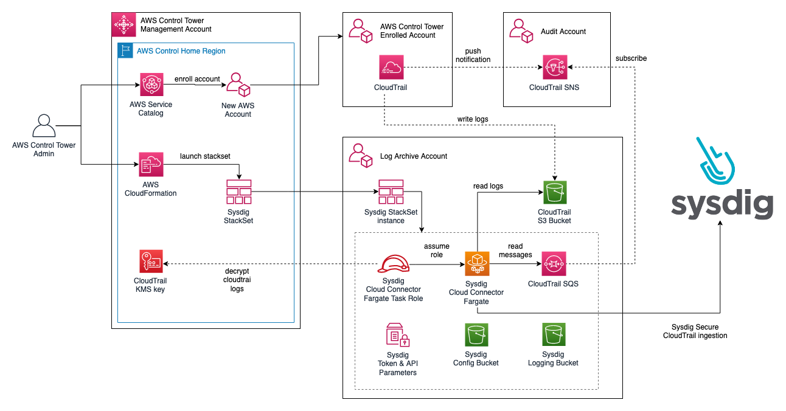

# Sysdig AWS Control Tower Integration

This repo provide example of integration for Sysdig CloudConnector (Real-Time Threat Investigation based on CloudTrail) inside AWS Control Tower environment

## Architecture



This solution utilize existing AWS Control Tower infrastructure and centralized the CloudTrail log collection in the `log archive` account. CloudTrail logs from existing linked accounts and future vending accounts is automatically ingested.

## Getting Started 

Run the following command on your AWS Control Tower management account (requires Admin privilege)

```
aws cloudformation create-stack --stack-name Sysdig-CT --template-url https://wellsiau-quickstart.s3.amazonaws.com/sysdig/templates/sysdig_ct_onboarding.yaml --parameters file://params.json --capabilities CAPABILITY_NAMED_IAM
```

Example of the `params.json`:

```
[
  {
    "ParameterKey": "SysdigSecureEndpoint",
    "ParameterValue": "https://us2.app.sysdig.com"
  }, 
  {
    "ParameterKey": "SysdigSecureAPIToken",
    "ParameterValue": "REDACTED - CHANGE WITH YOUR SYSDIG TOKEN"
  },
  {
    "ParameterKey": "StackSetName",
    "ParameterValue": "Sysdig-Secure-CT"
  },
  {
    "ParameterKey": "StackSetUrl",
    "ParameterValue": "https://wellsiau-quickstart.s3.amazonaws.com/sysdig/templates/sysdig_ct_stackset.yaml"
  },
  {
    "ParameterKey": "QSS3BucketName",
    "ParameterValue": "wellsiau-quickstart"
  },
  {
    "ParameterKey": "QSS3KeyPrefix",
    "ParameterValue": "sysdig/"
  },
  {
    "ParameterKey": "AuditAccount",
    "ParameterValue": "CHANGE WITH YOUR AWS CT AUDIT ACCOUNT"
  },
  {
    "ParameterKey": "LogArchiveAccount",
    "ParameterValue": "CHANGE WITH YOUR AWS CT LOG ARCHIVE ACCOUNT"
  }
]
```

## Build

To build this solution:
- git clone `https://github.com/wellsiau-aws/sysdig-ct-integration.git`
- Locate the `Makefile` in the root directory
- Update the `BUCKET_PREFIX` with your own S3 bucket (require public read)
- Run `make build`
- Run `make upload`
- Launch the onboarding stack: `aws cloudformation create-stack --stack-name Sysdig-CT --template-url https://wellsiau-quickstart.s3.amazonaws.com/sysdig/templates/sysdig_ct_onboarding.yaml --parameters file://params.json --capabilities CAPABILITY_NAMED_IAM`
- See reference to `params.json` in the getting started section
